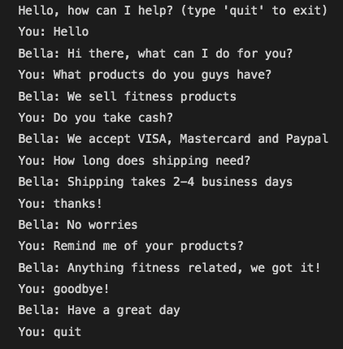
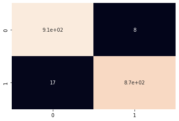

# Abdul Khalifa's Portfolio
Welcome to my portfolio! Navigate this page to check out the cool projects and tasks I have been working on, along with an update on what I am currently learing and what projects I am working on.

# [Project 1: E-Commerce ChatBot](https://github.com/akhalifaa/EcommerceChatBot) 🤖
## Project Overview:
* Created an Ecommerce style Chatbot that interacts with customers inquiring about things like **products, delivery times, and payment methods**
* Built a Json intents file containing various **tags, patterns and responses strings** that I tailored to an Ecommerce environment and used to train and test my model.
* Trained my Chatbot model with a feed forward neural network containing linear input, hidden and output layer with ReLU activation in between layers and a softmax activation for classification.
* Observed metrics such as training loss, accuracy score and f1 score of the model after training.

| Layer Name & Type | In_Features | Out_Features |
| :---              |:---:        |          ---:|
| l1 linear (input)         | 52          | 8            |
| l2 linear (hidden) | 8 | 8 | 
| l3 linear (output) | 8       | 6|

*A tabular visualisation of the in and out features along with the neural network structure.*

*A sample convo with the Bot, notice how the bot was asked twice about the products they sell in different ways and was responsive!* 

# [Project 2: Canada Housing Market, An Exploratory Analysis](https://github.com/akhalifaa/CanadaHousing) 🏠
## Project Overview:
* An exploratory analysis of the Canadian Housing Market, observed features such as number of households, household income, value and more.
* Utilized multiple data visualisation techniques to portray insights and explain how the different columns in the data frame correlate.
* Split up the data for training and testing, fit the data on 3 different regression models: Linear, Ridge and SVR and observed the root mean squared error of each model result.

*A method of holistically checking out the correlation between different columns in our data*

# [Project 3: Concrete Crack Detection](https://github.com/akhalifaa/Concrete-Crack-Detection) 🏗️
## Project Overview:
* Downloaded a large [data set](https://www.kaggle.com/datasets/arunrk7/surface-crack-detection) of cracked and non-cracked concrete images from Kaggle and trained a model to detect cracks on a test set of similar concrete specimens.
* Created a four layer convoluted neural network model with ReLU activation and maxpooling in between layers and a sigmoid activation for clsssification. I implemented the model with a (3,3) kernel size and a (2,2) pooling size.
* Observed some metrics for the model after training it and looked at the accuracy, training loss and the cofusion matrix after testing the model on the testing set. The model accuracy came to be 98.61%.

*Cracked Concrete Specimen that the model classifies as 1 or Cracked*

*Confusion Matrix Representing the Accuracy of the model on the test data*

# [Cool Task 1: DNAandSoccerTournament]() ⚽ 🧬
## Task Overview:
This repository contains two separate cool tasks I did with Python that have interesting applications:
1) Tournament.py is a script that simulates the famous soccer FIFA World Cup to come up the percent chance of a participating country to win based on past World Cup stats and winning streaks that give each country a rating. Along with it are the [2018m](https://github.com/akhalifaa/DNAandSoccerTournament/blob/main/2018m.csv) and [2019w](https://github.com/akhalifaa/DNAandSoccerTournament/blob/main/2019w.csv) that have the men's and women's soccer World Cup team ratings respectively.
2) DNA.py is a script that reads [DNA sequences](https://github.com/akhalifaa/DNAandSoccerTournament/tree/main/sequences) and searches a [DNA database](https://github.com/akhalifaa/DNAandSoccerTournament/tree/main/databases) to match that sequence to an individual. This concept has applications in crime detection and is actually used to investigate crimes.

# [Cool Task 2: Shopify Data Science Challenge 2022](https://github.com/akhalifaa/ShopifyDSChallenge2022) 🛒
## Task Overview:
* My work, thought process and solutions to Shopify's 2022 Data Science Technical challenge. 

**Question 1**: Given some sample data, write a program to answer the following: click here to access the required data set

On Shopify, we have exactly 100 sneaker shops, and each of these shops sells only one model of shoe. We want to do some analysis of the average order value (AOV). When we look at orders data over a 30 day window, we naively calculate an AOV of $3145.13. Given that we know these shops are selling sneakers, a relatively affordable item, something seems wrong with our analysis. 

Think about what could be going wrong with our calculation. Think about a better way to evaluate this data. 
What metric would you report for this dataset?
What is its value?

**Question 2**: For this question you’ll need to use SQL. Follow this link to access the data set required for the challenge. Please use queries to answer the following questions. Paste your queries along with your final numerical answers below.

How many orders were shipped by Speedy Express in total?

What is the last name of the employee with the most orders?

What product was ordered the most by customers in Germany?

# [Cool Task 3: MysterySolverSQL](https://github.com/akhalifaa/MysterySolverSQL) 🕵️
## Task Overview:
* The problem given was that a theft occured on a certain date and street name that were provided to me. Given was a database file with 10 tables of varying columns related to the different aspects of the crime.
* For example, some of the tables given were: suspect interviews, flights out of the city, ATM transactions, security footage and more...
* The goal was to strategically navigate all the tables and join them in order to figure out the thief, accomplice and city of escape.
* The way I tackled this task was through a series of queries as seen in my log.sql file, all queries are titled with a common and are run one query at a time. Query by query I was able to determine the relevant columns to look at and narrow down the data to obtain the solution. Every q.text file has the result of my subsequent queries.

# [Cool Task 4: Tweet Sentiment Analysis](https://github.com/akhalifaa/CanadaHousingTweets) 😄 😞
## Project Overview:
* A simple task/project that portrays a sentiment analysis technique I used to classify Tweets regarding the Housing market in Canada.
* Created a vectorizer based on the Tweets in order to map out all the words to corresponding unique vectors of real numbers.
* Created a predictive Multinomial Naive Bayes Classifier model to classify the Tweets as positive or negative.
